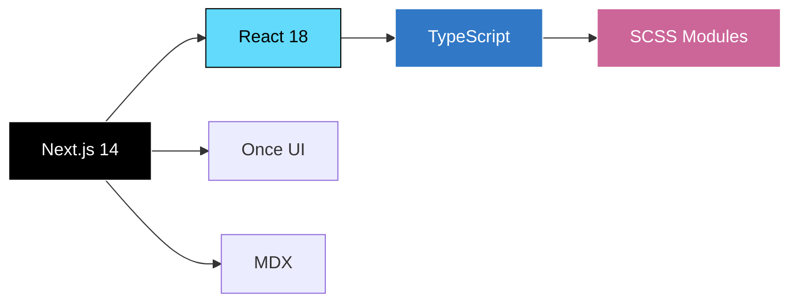
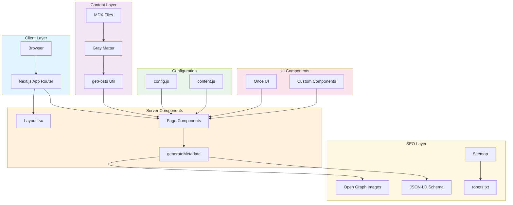
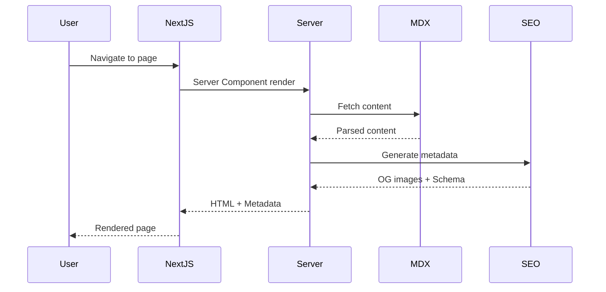
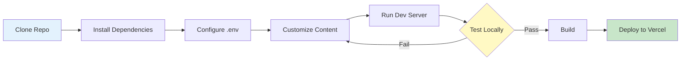
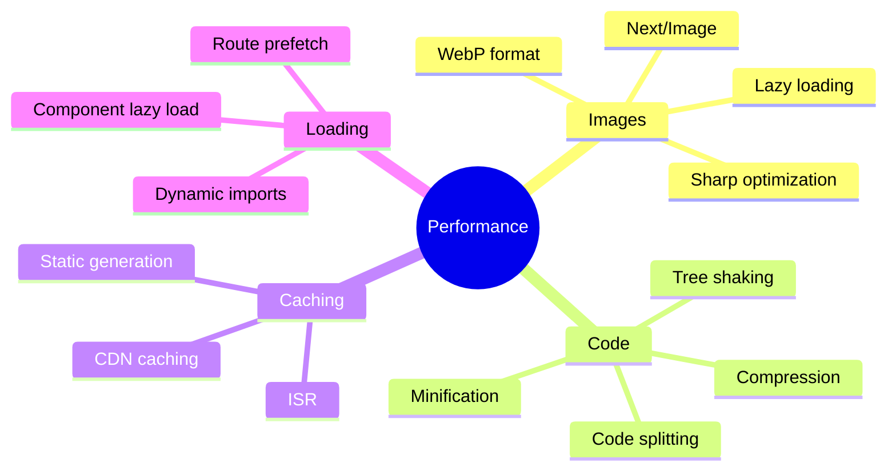
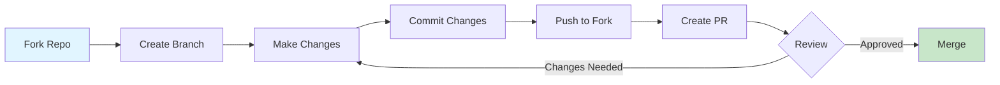

<div align="center">


# 🎨 Mausam Kar - Portfolio Website

### Design Engineer | Full Stack Developer | AI/ML Enthusiast

[](https://mausam04.vercel.app)
[](https://github.com/Mausam5055)
[](https://www.linkedin.com/in/mausam-kar-6388861a7/)


</div>

---

## 📋 Table of Contents

- [Overview](#-overview)
- [Features](#-features)
- [Tech Stack](#-tech-stack)
- [Architecture](#-architecture)
- [Project Structure](#-project-structure)
- [Getting Started](#-getting-started)
- [Configuration](#-configuration)
- [SEO & Performance](#-seo--performance)
- [Projects Showcase](#-projects-showcase)
- [Deployment](#-deployment)
- [Contributing](#-contributing)
- [License](#-license)

---

## 🌟 Overview

A modern, performant, and SEO-optimized portfolio website showcasing my work as a **Design Engineer** and **Full Stack Developer**. Built with cutting-edge technologies and best practices, this portfolio features:

- 🎯 **16+ Full-Stack Projects** ranging from AI/ML to eCommerce
- ✨ **Smooth Animations** powered by Lenis & GSAP
- 🎨 **Once UI Design System** for consistent, beautiful components
- 📱 **Fully Responsive** across all devices
- 🚀 **Blazing Fast** performance with Next.js 14
- 🔍 **SEO Optimized** with dynamic Open Graph images & structured data

---

## ✨ Features

### 🎨 Design & UX

| Feature               | Description                                              |
| --------------------- | -------------------------------------------------------- |
| **Smooth Scrolling**  | Lenis-powered buttery smooth scroll experience           |
| **Dark Mode**         | Elegant dark theme with consistent design tokens         |
| **Responsive Design** | Mobile-first approach, optimized for all screen sizes    |
| **Masonry Gallery**   | Beautiful project showcase with dynamic layouts          |
| **Interactive UI**    | Hover effects, reveal animations, and micro-interactions |

### 🔧 Technical Features

| Feature                | Description                                               | Technology           |
| ---------------------- | --------------------------------------------------------- | -------------------- |
| **MDX Blog**           | Write blog posts in MDX with full React component support | MDX, Gray Matter     |
| **Dynamic Routing**    | Auto-generated routes for blog posts & projects           | Next.js App Router   |
| **Image Optimization** | Automatic image optimization & lazy loading               | Next.js Image, Sharp |
| **Type Safety**        | Full TypeScript coverage for better DX                    | TypeScript 5+        |
| **Code Highlighting**  | Syntax highlighting for code blocks                       | PrismJS              |

### 📊 SEO & Analytics

| Feature                 | Status | Implementation                  |
| ----------------------- | ------ | ------------------------------- |
| **Open Graph Images**   | ✅     | Dynamic OG image generation     |
| **Schema Markup**       | ✅     | JSON-LD structured data         |
| **Sitemap**             | ✅     | Auto-generated XML sitemap      |
| **Robots.txt**          | ✅     | SEO-friendly crawler directives |
| **Meta Tags**           | ✅     | Dynamic page-specific metadata  |
| **Google Verification** | ✅     | Search Console verified         |

---

## 🛠️ Tech Stack

### Core Technologies



### Dependencies

| Category       | Package                       | Version | Purpose                      |
| -------------- | ----------------------------- | ------- | ---------------------------- |
| **Framework**  | `next`                        | 14.2.16 | React framework with SSR/SSG |
| **UI Library** | `react`                       | 18.3.1  | Component library            |
| **Language**   | `typescript`                  | 5.0+    | Type safety                  |
| **Styling**    | `sass`                        | 1.77.6  | CSS preprocessor             |
| **Animations** | `@studio-freight/react-lenis` | 0.0.47  | Smooth scrolling             |
| **Content**    | `@mdx-js/loader`              | 3.1.0   | MDX processing               |
| **Markdown**   | `gray-matter`                 | 4.0.3   | Frontmatter parsing          |
| **Gallery**    | `react-masonry-css`           | 1.0.16  | Masonry layouts              |
| **Images**     | `sharp`                       | 0.33.4  | Image optimization           |

---

## 🏗️ Architecture

### Application Architecture



### Data Flow



---

## 📁 Project Structure

```
Mausam04/
├── 📁 public/                    # Static assets
│   ├── cover.png                 # Preview image
│   ├── favicon.ico
│   ├── 📁 images/                # Project images
│   └── 📁 fonts/                 # Custom fonts
│
├── 📁 src/
│   ├── 📁 app/                   # Next.js App Router
│   │   ├── layout.tsx            # Root layout with metadata
│   │   ├── page.tsx              # Homepage
│   │   │
│   │   ├── 📁 about/             # About page
│   │   │   └── page.tsx
│   │   │
│   │   ├── 📁 blog/              # Blog section
│   │   │   ├── page.tsx
│   │   │   ├── 📁 posts/         # MDX blog posts
│   │   │   └── 📁 [slug]/        # Dynamic blog routes
│   │   │
│   │   ├── 📁 work/              # Portfolio projects
│   │   │   ├── page.tsx
│   │   │   ├── 📁 projects/      # MDX project pages
│   │   │   └── 📁 [slug]/        # Dynamic project routes
│   │   │
│   │   ├── 📁 projects/          # Projects gallery
│   │   │   └── page.tsx
│   │   │
│   │   ├── 📁 og/                # OG image generation
│   │   │   └── route.tsx
│   │   │
│   │   ├── 📁 resources/         # Configuration
│   │   │   ├── config.js         # Site config
│   │   │   └── content.js        # Content data
│   │   │
│   │   ├── 📁 utils/             # Utility functions
│   │   ├── robots.ts             # robots.txt
│   │   └── sitemap.ts            # sitemap.xml
│   │
│   ├── 📁 components/            # React components
│   │   ├── 📁 blog/
│   │   ├── 📁 work/
│   │   ├── 📁 gallery/
│   │   └── 📁 about/
│   │
│   └── 📁 once-ui/               # Once UI design system
│       ├── 📁 components/
│       ├── 📁 styles/
│       └── 📁 tokens/
│
├── package.json
├── tsconfig.json
├── next.config.mjs
└── README.md
```

---

## 🚀 Getting Started

### Prerequisites

| Requirement | Version |
| ----------- | ------- |
| **Node.js** | 18.17+  |
| **npm**     | 9.0+    |
| **Git**     | Latest  |

### Installation

```bash
# 1. Clone the repository
git clone https://github.com/Mausam5055/Mausam04.git
cd Mausam04

# 2. Install dependencies
npm install

# 3. Set up environment variables
cp .env.example .env
# Edit .env with your configuration

# 4. Run development server
npm run dev
```

### Development Workflow



---

## ⚙️ Configuration

### 1. Site Configuration (`src/app/resources/config.js`)

```javascript
const baseURL = "mausam04.vercel.app";

const style = {
  theme: "dark", // dark | light
  neutral: "gray", // sand | gray | slate
  brand: "emerald", // color palette
  accent: "orange",
  // ... more options
};
```

### 2. Content Configuration (`src/app/resources/content.js`)

```javascript
const person = {
  firstName: "Mausam",
  lastName: "Kar",
  role: "Design Engineer",
  avatar: "/images/avatar.jpg",
  location: "Asia/Kolkata",
  // ...
};
```

### 3. Environment Variables

| Variable               | Description                   | Required |
| ---------------------- | ----------------------------- | -------- |
| `NEXT_PUBLIC_BASE_URL` | Base URL for the site         | ✅       |
| `ROUTE_PASSWORD`       | Password for protected routes | ❌       |

---

## 🔍 SEO & Performance

### SEO Features Implemented

✅ **Open Graph Protocol**

- Dynamic OG image generation for each page
- Proper meta tags for social sharing
- Twitter Card support

✅ **Structured Data (JSON-LD)**

- WebPage schema for homepage
- BlogPosting schema for blog posts
- Person schema for about page
- CollectionPage schema for portfolios

✅ **Technical SEO**

- XML sitemap auto-generation
- robots.txt configuration
- Canonical URLs
- Google Search Console verification

### Performance Metrics

| Metric                       | Score  | Status |
| ---------------------------- | ------ | ------ |
| **Lighthouse Performance**   | 95+    | 🟢     |
| **First Contentful Paint**   | < 1.5s | 🟢     |
| **Largest Contentful Paint** | < 2.5s | 🟢     |
| **Cumulative Layout Shift**  | < 0.1  | 🟢     |
| **Time to Interactive**      | < 3.0s | 🟢     |

### Optimization Techniques



---

## 🎨 Projects Showcase

This portfolio features **16+ full-stack projects** across various domains:

### Project Categories

| Category           | Count | Technologies                   |
| ------------------ | ----- | ------------------------------ |
| **AI/ML**          | 3     | Python, TensorFlow, LLMs, RAG  |
| **Full Stack Web** | 6     | MERN, Next.js, MongoDB         |
| **eCommerce**      | 2     | Stripe, Razorpay, Payment APIs |
| **Real-time Apps** | 2     | WebRTC, Socket.io              |
| **Automation**     | 2     | Node.js, APIs, Bots            |
| **UI/UX**          | 5     | React, GSAP, Three.js, Lenis   |

### Featured Projects

<details>
<summary><b>🤖 RAG System (Retrieval Augmented Generation)</b></summary>

- **Tech**: Pinecone, Next.js, OpenAI API
- **Features**: Vector embeddings, Semantic search, LLM chat interface
- **Impact**: Improves AI accuracy by 40%

</details>

<details>
<summary><b>🛡️ Phishing Detection System</b></summary>

- **Tech**: Python, ML Models, Flask
- **Features**: URL risk prediction, Threat visualization
- **Impact**: Protects users from malicious websites

</details>

<details>
<summary><b>🏪 Trendify - Multi-Vendor eCommerce</b></summary>

- **Tech**: Next.js, MongoDB, Stripe, Razorpay
- **Features**: Vendor dashboard, Product management, Payment gateways
- **Impact**: Enterprise-level marketplace solution

</details>

<details>
<summary><b>📞 Connect Flow - Communication Platform</b></summary>

- **Tech**: WebRTC, Socket.io, React, Node.js
- **Features**: Video calls, Group chat, Real-time status
- **Impact**: Demonstrates WebRTC expertise

</details>

[**View All Projects →**](https://mausam04.vercel.app/projects)

---

## 📦 Deployment

### Deploy to Vercel (Recommended)

[](https://vercel.com/new)

```bash
# 1. Build the project
npm run build

# 2. Deploy to Vercel
npx vercel
```

### Manual Deployment

```bash
# Build for production
npm run build

# Start production server
npm start
```

### Deployment Checklist

- [ ] Update `baseURL` in `config.js`
- [ ] Set environment variables
- [ ] Configure domain settings
- [ ] Verify SEO metadata
- [ ] Test all routes
- [ ] Submit sitemap to Google Search Console

---

## 🤝 Contributing

Contributions are welcome! Please follow these steps:



1. Fork the repository
2. Create a feature branch (`git checkout -b feature/AmazingFeature`)
3. Commit your changes (`git commit -m 'Add some AmazingFeature'`)
4. Push to the branch (`git push origin feature/AmazingFeature`)
5. Open a Pull Request

---

## 📄 License

This project is licensed under the **MIT License** - see the [LICENSE](LICENSE) file for details.

---

## 📧 Contact

**Mausam Kar** - Design Engineer

[](https://mausam04.vercel.app)
[](mailto:rikikumkar@gmail.com)
[](https://github.com/Mausam5055)
[](https://www.linkedin.com/in/mausam-kar-6388861a7/)

---

## 🙏 Acknowledgments

- **[Once UI](https://once-ui.com)** - Beautiful design system
- **[Next.js](https://nextjs.org)** - Amazing React framework
- **[Vercel](https://vercel.com)** - Seamless deployment platform
- **[Lenis](https://lenis.studiofreight.com/)** - Smooth scrolling library

---

<div align="center">

### ⭐ Star this repo if you find it helpful!

Made with ❤️ by [Mausam Kar](https://mausam04.vercel.app)


</div>
