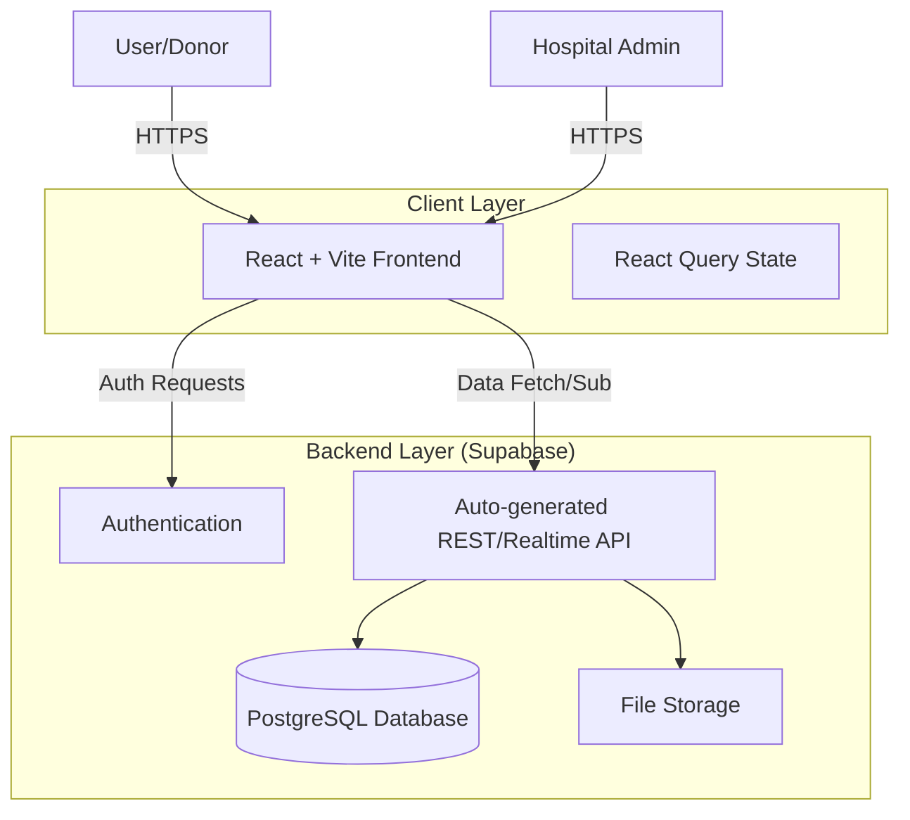
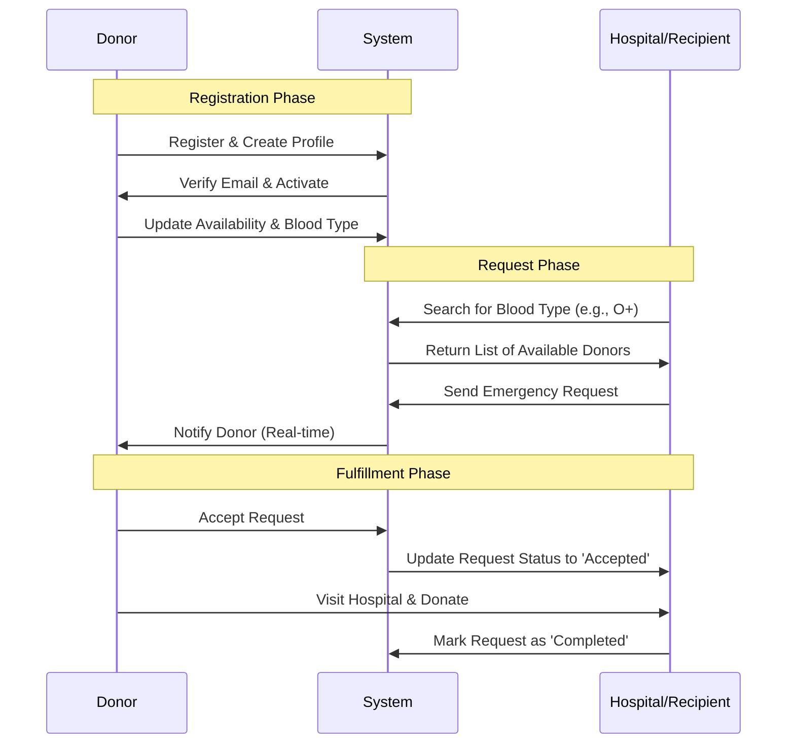
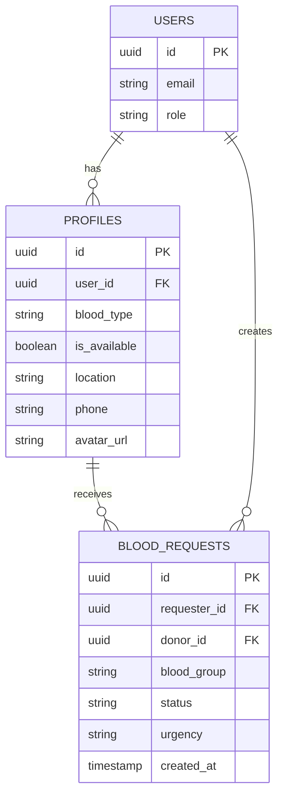

# 🩸 Blood Bank Management System

[](https://blood-bank-management-gamma.vercel.app/)
[](LICENSE)
[](https://react.dev/)
[](https://www.typescriptlang.org/)
[](https://tailwindcss.com/)

## 🌐 Live Demo

**Website:** [https://blood-bank-management-gamma.vercel.app/](https://blood-bank-management-gamma.vercel.app/)

## 📖 Project Overview

Blood Bank Management System is a modern, full-stack web application designed to streamline the process of blood donation, donor management, and blood requests. The platform connects donors, hospitals, and recipients, making it easier to save lives through efficient blood management. It leverages the power of Supabase for real-time data handling and React for a responsive user interface.

## 🚀 Features

| Feature                   | Description                                                                                          |
| ------------------------- | ---------------------------------------------------------------------------------------------------- |
| **Donor Registration**    | Easy sign-up and profile management for blood donors with availability toggles.                      |
| **Blood Request System**  | Emergency blood request creation with tracking of request status (Pending, Accepted, Completed).     |
| **Smart Donor Search**    | Advanced filtering to find donors by specific blood type, location, and real-time availability.      |
| **Hospital Dashboard**    | Dedicated interface for hospitals to manage blood inventory, requests, and donor lists.              |
| **Event Management**      | Tools to organize, promote, and manage blood donation camps and events.                              |
| **Educational Resources** | Integrated blog and resource section to educate users about the importance of blood donation.        |
| **Secure Authentication** | Role-based authentication (Donor, Hospital, Admin) using Supabase Auth.                              |
| **Responsive UI**         | Mobile-first design ensures accessibility across all devices, built with Tailwind CSS and shadcn-ui. |
| **Real-time Analytics**   | Visual dashboard displaying donor statistics, request fulfillment rates, and inventory levels.       |

## 🏗️ System Architecture

The application follows a serverless architecture pattern, utilizing Supabase as a Backend-as-a-Service (BaaS) to handle database, authentication, and real-time subscriptions.



## 🔄 User Workflow

The following sequence diagram illustrates the core workflow of a donor registering and a hospital requesting blood.



## 💾 Database Schema (Conceptual)

The data model is designed to support relationships between users, profiles, and blood requests.



## 🛠️ Tech Stack

- **Frontend:** [React](https://react.dev/), [TypeScript](https://www.typescriptlang.org/), [Vite](https://vitejs.dev/)
- **UI Framework:** [Tailwind CSS](https://tailwindcss.com/), [shadcn-ui](https://ui.shadcn.com/)
- **State Management:** [React Query](https://tanstack.com/query/latest) (for server state & caching)
- **Backend & Database:** [Supabase](https://supabase.com/) (PostgreSQL, Auth, Realtime)
- **Deployment:** [Vercel](https://vercel.com/)
- **Icons:** [Lucide React](https://lucide.dev/)

## ⚡ Getting Started

### Prerequisites

- Node.js & npm (recommended: use [nvm](https://github.com/nvm-sh/nvm#installing-and-updating))
- A Supabase project (for environment variables)

### Setup

```bash
# 1. Clone the repository
git clone https://github.com/Mausam5055/Blood-Bank-Management.git
cd Blood-Bank-Management

# 2. Install dependencies
npm install

# 3. Configure Environment Variables
# Create a .env file and add your Supabase credentials
# VITE_SUPABASE_URL=your_supabase_url
# VITE_SUPABASE_ANON_KEY=your_supabase_anon_key

# 4. Start the development server
npm run dev
```

## 🌍 Deployment

This project is optimized for deployment on [Vercel](https://vercel.com/).

1. Fork or clone this repository.
2. Push to your GitHub account.
3. Import the repo into Vercel.
4. Set up the environment variables (`VITE_SUPABASE_URL`, `VITE_SUPABASE_ANON_KEY`) in the Vercel dashboard.
5. Deploy!

## 📄 License

This project is licensed under the MIT License.

## 🙏 Contributing

Contributions are welcome! Please open issues or submit pull requests for improvements.

1. Fork the repository
2. Create your feature branch (`git checkout -b feature/AmazingFeature`)
3. Commit your changes (`git commit -m 'Add some AmazingFeature'`)
4. Push to the branch (`git push origin feature/AmazingFeature`)
5. Open a Pull Request

## 📣 Credits

- Built with [React](https://react.dev/), [Vite](https://vitejs.dev/), [Tailwind CSS](https://tailwindcss.com/), [Supabase](https://supabase.com/), and [shadcn-ui](https://ui.shadcn.com/).

## 👤 Author

**Mausam Kar**

- Email: [mausamkumkar@gmail.com](mailto:mausamkumkar@gmail.com)
- Phone: +918638545574
- GitHub: [@Mausam5055](https://github.com/Mausam5055)
- Portfolio: [mausam03.vercel.app](https://mausam03.vercel.app)
