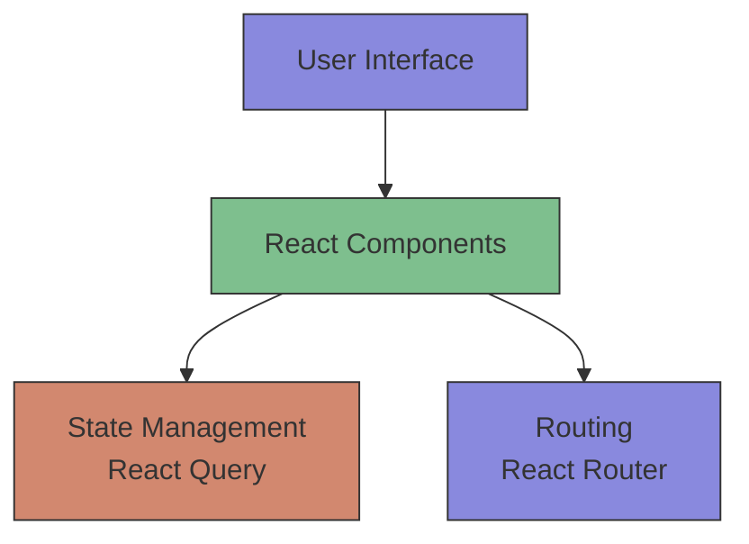
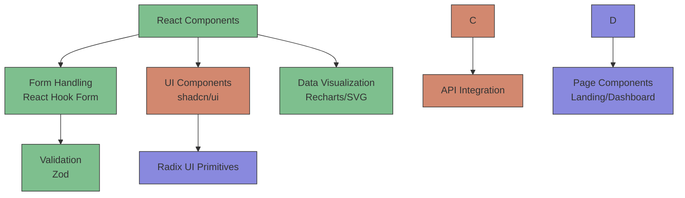
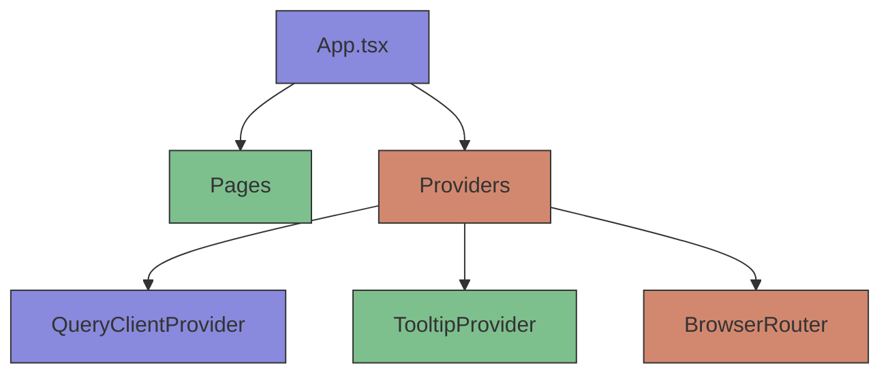
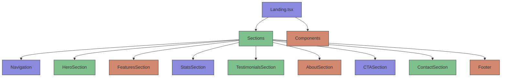
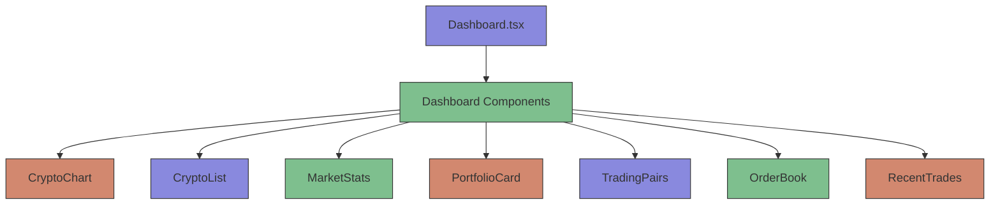
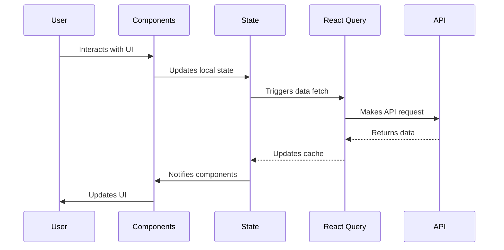

<h1 align="center">CryptoTrade</h1>

<p align="center">
  <b>Trade Crypto with Confidence</b>
  <br />
  Advanced, zero-fee cryptocurrency trading platform with real-time analytics,
  institutional-grade security, and a modern UI.
  <br />
  
  
  
  
</p>

<p align="center">
  
</p>

---

## 🚀 Overview

**CryptoTrade** is a next-generation cryptocurrency trading platform designed for both beginners and professionals. Enjoy advanced charting, real-time data, portfolio management, and robust security—all with zero trading fees.

---

## ✨ Features

### Core Trading Features

| Feature                        | Description                                                             |
| ------------------------------ | ----------------------------------------------------------------------- |
| **Advanced Trading Interface** | Professional-grade tools, real-time market data, and advanced charting. |
| **Portfolio Management**       | Track investments and monitor gains with comprehensive tools.           |
| **Security & Verification**    | Industry-leading security and KYC verification to protect your assets.  |
| **Performance Analytics**      | Detailed analytics and insights for informed trading decisions.         |
| **Zero Fees**                  | 100% free trading for all users.                                        |
| **Modern UI**                  | Clean, responsive, and intuitive interface.                             |

### Technical Features

1. **Real-time Data Streaming**

   Live price updates for all supported cryptocurrencies are delivered instantly via WebSocket integration, ensuring low-latency updates for active traders.

2. **Advanced Charting**

   The platform offers multiple chart types including candlestick, line, and area charts, equipped with technical indicators like RSI, MACD, and Bollinger Bands. Users can utilize drawing tools for technical analysis across customizable timeframes.

3. **Order Management**

   Traders can execute market and limit orders, set stop-loss and take-profit levels, and track their order history. The system also provides real-time order book updates.

4. **Portfolio Tracking**

   Users can visualize their asset allocation, monitor performance metrics and analytics, calculate profit/loss, and view their complete transaction history.

5. **Market Analysis**
   The platform provides cryptocurrency rankings, market sentiment indicators, trading volume analysis, and access to historical price data.

### User Experience Features

1. **Responsive Design**

   The interface is designed to work seamlessly on desktop, tablet, and mobile devices, featuring a touch-optimized interface for mobile trading and adaptive layouts for different screen sizes.

2. **Accessibility**

   Adhering to WCAG 2.1 AA compliance, the platform supports keyboard navigation, screen reader compatibility, and a high contrast mode for better accessibility.

3. **Performance Optimization**

   The application is optimized for fast loading times and efficient data handling, ensuring minimal resource usage and offline capability for static content.

4. **Security Features**
   Security is paramount, with two-factor authentication, encrypted data transmission, secure session management, and regular security audits to protect user data.

---

## 📊 Platform Statistics

| Metric         | Value  | Description              |
| -------------- | ------ | ------------------------ |
| Trading Volume | $2.8B+ | Monthly trading activity |
| Active Traders | 500K+  | Global community members |
| Uptime         | 99.9%  | Platform reliability     |

---

## 🖼️ Preview

| Landing Page                                                        | Dashboard                                                             |
| ------------------------------------------------------------------- | --------------------------------------------------------------------- |
|  |  |

---

## 💡 Why Choose CryptoTrade?

CryptoTrade is **100% Free** with no hidden fees, ever. It provides **Real-Time Insights** to help you stay ahead with live data and analytics. Your assets are protected with **Institutional-Grade Security** standards, and the platform is **Trusted by 500K+ Traders**, joining a growing global community.

---

## 🛠️ Tech Stack

### Frontend Framework

- **[React 18](https://reactjs.org/)**: Modern UI library for building interactive user interfaces, featuring concurrent features for improved performance, automatic batching for state updates, and a new root API for better tree management.
- **[TypeScript](https://www.typescriptlang.org/)**: Strongly typed programming language that builds on JavaScript, providing type safety to reduce runtime errors and improving developer experience with IntelliSense and better code documentation.

### Build Tool

- **[Vite](https://vitejs.dev/)**: Next generation frontend tooling that offers lightning-fast cold server starts, instant hot module replacement (HMR), and optimized builds with Rollup.

### Styling

- **[TailwindCSS](https://tailwindcss.com/)**: Utility-first CSS framework allowing for custom theme configuration, responsive design utilities, and dark mode support through a component-based styling approach.
- **Custom Styling Features**: The application incorporates glass morphism effects, gradient animations, micro-interactions, and responsive typography to enhance the visual experience.

### UI Components

- **[shadcn/ui](https://ui.shadcn.com/)**: Re-usable components built with Radix UI and Tailwind CSS, providing accessible, customizable, and copy-paste ready components with no runtime dependencies.
- **[Radix UI](https://www.radix-ui.com/)**: Unstyled, accessible UI primitives that ensure WCAG compliance, full keyboard navigation support, screen reader compatibility, and robust focus management.

### State Management

- **[React Query](https://tanstack.com/query/latest) (TanStack Query)**: Manages server state with features like caching, background updates, request deduplication, pagination, infinite queries, and optimistic updates.

### Routing

- **[React Router](https://reactrouter.com/)**: Handles declarative routing for React, supporting dynamic routing, nested routes, programmatic navigation, and route-based code splitting.

### Form Handling

- **[React Hook Form](https://react-hook-form.com/)**: Facilitates performant, flexible forms with easy validation, minimal re-renders, built-in Zod integration, and accessibility support.

### Data Visualization

- **[Recharts](https://recharts.org/)**: A composable charting library built with React components, offering declarative, responsive, and interactive charts with SVG-based rendering.
- **Custom SVG Charts**: Implemented for lightweight, tailored visualizations such as animated line charts and real-time data updates with custom styling.

### Validation

- **[Zod](https://zod.dev/)**: A TypeScript-first schema declaration and validation library that provides type inference, error handling, and seamless integration with React Hook Form.

### Icons

- **[Lucide React](https://lucide.dev/)**: A beautiful and consistent icon toolkit featuring over 1000 tree-shakable icons with consistent stroke widths.

### Animation

- **[Framer Motion](https://www.framer.com/motion/)**: A production-ready motion library for React with a declarative API, supporting layout animations, gestures, and server-side rendering.

### Development Tools

- **[ESLint](https://eslint.org/)**: Ensures code quality and consistency by enforcing rules and preventing errors in JavaScript and TypeScript code.
- **[Prettier](https://prettier.io/)**: An opinionated code formatter that integrates with editors and pre-commit hooks to maintain consistent code style.

### Testing

- **[Jest](https://jestjs.io/)**: JavaScript testing framework
- **[React Testing Library](https://testing-library.com/)**: React component testing utilities
- **[Cypress](https://www.cypress.io/)**: End-to-end testing framework

### Deployment

- **[Vercel](https://vercel.com/)**: A cloud platform for static sites and Serverless Functions, offering global CDN, automatic HTTPS, Git integration, and serverless capabilities.

---

## 🏗️ Architecture

### High-Level Architecture

The CryptoTrade platform follows a modern React architecture with clear separation of concerns:





### Component Architecture

#### Application Structure



#### Landing Page Components



#### Dashboard Components



### Data Flow Architecture



---

## 📁 Project Structure

The project follows a organized structure to maintain scalability and separation of concerns:

```
src/
├── components/              # Reusable UI components
│   ├── sections/            # Page sections (landing page components)
│   │   ├── AboutSection.tsx
│   │   ├── CTASection.tsx
│   │   ├── ContactSection.tsx
│   │   ├── FeaturesSection.tsx
│   │   ├── Footer.tsx
│   │   ├── HeroSection.tsx
│   │   ├── Navigation.tsx
│   │   ├── StatsSection.tsx
│   │   └── TestimonialsSection.tsx
│   ├── ui/                  # shadcn/ui components
│   │   ├── button.tsx
│   │   ├── card.tsx
│   │   ├── dialog.tsx
│   │   └── ...              # Other UI components
│   ├── BackgroundGrid.tsx
│   ├── ChatWidget.tsx
│   ├── CryptoChart.tsx
│   ├── CryptoList.tsx
│   ├── MarketStats.tsx
│   ├── OrderBook.tsx
│   ├── PortfolioCard.tsx
│   ├── RecentTrades.tsx
│   ├── TradingChart.tsx
│   └── TradingPairs.tsx
├── hooks/                   # Custom React hooks
│   ├── use-toast.ts
│   ├── useContentLoader.ts
│   └── useScrollPosition.ts
├── lib/                     # Utility functions
│   └── utils.ts
├── pages/                   # Page components
│   ├── Dashboard.tsx
│   ├── Index.tsx
│   └── Landing.tsx
├── App.css
├── App.tsx                  # Main application component
├── index.css
├── main.tsx                 # Entry point
└── vite-env.d.ts
```

### Key Components

#### 1. **Landing Page** (`/src/pages/Landing.tsx`)

The main entry point for new users with marketing-focused sections:

- **HeroSection**: Main value proposition with animated trading chart
- **FeaturesSection**: Key platform features with icons
- **StatsSection**: Platform statistics and achievements
- **TestimonialsSection**: User testimonials and reviews
- **AboutSection**: Company information and mission
- **CTASection**: Call-to-action for signups
- **ContactSection**: Contact information and form
- **Footer**: Additional links and legal information

#### 2. **Dashboard** (`/src/pages/Dashboard.tsx`)

The main trading interface for authenticated users:

- **CryptoChart**: Advanced TradingView integration for real-time charting
- **MarketStats**: Real-time market statistics and indicators
- **PortfolioCard**: User portfolio overview and performance
- **TradingPairs**: Available cryptocurrency trading pairs
- **OrderBook**: Current buy/sell orders for selected pair
- **RecentTrades**: History of recent trades
- **CryptoList**: List of available cryptocurrencies with prices

#### 3. **Core Components**

- `CryptoChart.tsx`: Advanced TradingView chart with fullscreen capability
- `TradingChart.tsx`: Custom SVG-based chart for landing page animations
- `MarketStats.tsx`: Real-time market statistics display
- `PortfolioCard.tsx`: User portfolio management component
- `TradingPairs.tsx`: List of available trading pairs with prices
- `OrderBook.tsx`: Order book display with buy/sell levels
- `RecentTrades.tsx`: Recent trades history with timestamps
- `BackgroundGrid.tsx`: Animated background grid for visual appeal
- `ChatWidget.tsx`: Customer support chat interface

---

## 🎨 Design System

### Color Palette

The platform uses a carefully crafted color palette designed for optimal readability and visual appeal in a trading environment:

| Color      | Value     | Usage                        |
| ---------- | --------- | ---------------------------- |
| Primary    | `#8989DE` | Main brand color             |
| Success    | `#7EBF8E` | Positive actions & data      |
| Warning    | `#D2886F` | Warnings & secondary actions |
| Secondary  | `#3A3935` | Backgrounds & cards          |
| Foreground | `#FAFAF8` | Text & primary content       |
| Background | `#141413` | Main background              |

### Typography

- **Primary Font**: System UI stack (tailwind default)
- **Font Weights**:
  - Light: 300
  - Regular: 400
  - Medium: 500
  - Bold: 700

The typography system emphasizes readability with appropriate sizing and spacing for financial data.

### Animations

The platform incorporates subtle animations to enhance user experience without being distracting:

- **Fade In**: `animate-fade-in` - Used for content reveals
- **Slide Up**: `animate-slide-up-fade` - Used for modal entries
- **Pulse**: `animate-pulse-subtle` - Used for live data indicators
- **Float**: `animate-float` - Used for decorative elements
- **Scale In**: `animate-scale-in` - Used for fullscreen transitions

### UI Components

The platform utilizes shadcn/ui components built on Radix UI primitives for accessible and customizable UI elements:

- **Buttons**: Primary, secondary, and outline variants
- **Cards**: Glass-morphism effect cards with backdrop blur
- **Dialogs**: Modal windows for confirmations and forms
- **Tables**: Data tables with sorting capabilities
- **Charts**: Recharts for data visualization and custom SVG charts

### Responsive Design

The platform follows a mobile-first responsive approach with breakpoints at:

- **Small**: 640px (sm)
- **Medium**: 768px (md)
- **Large**: 1024px (lg)
- **Extra Large**: 1280px (xl)
- **2X Large**: 1536px (2xl)

All components are designed to work seamlessly across device sizes with appropriate touch targets for mobile users.

---

## 📦 Getting Started

### Prerequisites

- Node.js (v16 or higher)
- npm or yarn
- Git

### Installation

```bash
# Clone the repository
git clone <repository-url>
cd Crypto-Trade

# Install dependencies
npm install

# Start the development server
npm run dev
```

The development server will start at `http://localhost:8080` by default.

### Available Scripts

```bash
# Start development server
npm run dev

# Build for production
npm run build

# Preview production build
npm run preview

# Lint code
npm run lint

# Build development version
npm run build:dev
```

---

## 🔧 Development

### Project Structure Guidelines

1. **Component Organization**

   - Reusable components go in `src/components/`
   - Page-specific components go in `src/pages/`
   - UI primitives go in `src/components/ui/`
   - Section components go in `src/components/sections/`

2. **Naming Conventions**

   - Components: PascalCase (`UserProfile.tsx`)
   - Functions: camelCase (`getUserData()`)
   - Constants: UPPER_SNAKE_CASE (`API_BASE_URL`)
   - Files: PascalCase for components, camelCase for utilities

3. **Styling**
   - Use TailwindCSS utility classes
   - Leverage custom color palette
   - Implement responsive design with mobile-first approach
   - Use glass morphism effects with `glass-card` class
   - Apply animations with predefined classes

### State Management

The application uses multiple state management approaches:

1. **Local Component State**

   - Managed with React's `useState` hook
   - Suitable for component-scoped data

2. **Global State**

   - Managed with React Query for server state
   - Form state with React Hook Form

3. **Custom Hooks**
   - Reusable logic encapsulated in custom hooks
   - Located in `src/hooks/` directory

### Component Development

To create a new component:

1. Create a new file in the appropriate directory
2. Use TypeScript for type safety
3. Follow existing styling patterns
4. Export the component properly
5. Add to index file if needed

Example component structure:

```tsx
import { useState } from "react";

interface ComponentProps {
  title: string;
  initialValue?: number;
}

const CustomComponent = ({ title, initialValue = 0 }: ComponentProps) => {
  const [value, setValue] = useState(initialValue);

  return (
    <div className="glass-card p-4 rounded-lg">
      <h2 className="text-xl font-semibold mb-2">{title}</h2>
      <p>Value: {value}</p>
      <button
        onClick={() => setValue((v) => v + 1)}
        className="btn-enhance mt-2"
      >
        Increment
      </button>
    </div>
  );
};

export default CustomComponent;
```

### Styling Guidelines

1. **TailwindCSS Usage**

   - Prefer utility classes over custom CSS
   - Use consistent spacing (multiples of 4px)
   - Leverage the custom color palette

2. **Responsive Design**

   - Mobile-first approach
   - Use appropriate breakpoints
   - Test on multiple screen sizes

3. **Animations**

   - Use predefined animation classes
   - Keep animations subtle and purposeful
   - Ensure accessibility compliance

4. **Glass Morphism Effects**
   - Use the `glass-card` class for frosted glass effects
   - Combine with `backdrop-blur` for enhanced effects
   - Maintain appropriate contrast for readability

### API Integration

1. **Data Fetching**

   - Use React Query for server state management
   - Implement proper error handling
   - Add loading states for better UX

2. **Form Handling**
   - Use React Hook Form for form state
   - Implement Zod for validation
   - Provide user feedback for form actions

### Testing

Currently, the project does not include automated tests. Consider adding:

- Unit tests with Jest and React Testing Library
- Integration tests for critical user flows
- End-to-end tests with Cypress

### Performance Optimization

1. **Code Splitting**

   - Use dynamic imports for large components
   - Lazy load non-critical resources

2. **Bundle Optimization**

   - Analyze bundle size with `npm run build -- --analyze`
   - Remove unused dependencies

3. **Image Optimization**
   - Use modern image formats (WebP)
   - Implement lazy loading for images

---

## 🚀 Deployment

### Building for Production

```bash
npm run build
```

This creates an optimized production build in the `dist/` directory.

### Environment Variables

Create a `.env` file in the root directory:

```env
VITE_API_URL=your_api_url
VITE_APP_NAME=CryptoTrade
```

### Deployment Options

1. **Vercel** (Recommended): Connect your GitHub repository for automatic deployments on push and custom domain support.
2. **Netlify**: Drag and drop the `dist/` folder or connect your Git repository, with automatic SSL included.
3. **Traditional Hosting**: Upload the contents of `dist/` to your web server and configure it to serve `index.html` for all routes.

### CI/CD Pipeline

The project includes a basic CI/CD setup with GitHub Actions:

1. **Build Process**: Install dependencies, run linting checks, and build production assets.
2. **Deployment Process**: Deploy to staging on pull requests and to production on main branch pushes.

### Performance Monitoring

Consider implementing:

Consider implementing error tracking with Sentry, performance monitoring with Lighthouse, and analytics with Google Analytics or Plausible.

---

## 🧪 Testing

The project currently lacks automated tests but follows these testing principles:

### Testing Strategy

1. **Unit Testing**: Test individual components in isolation, mock external dependencies, and focus on business logic.
2. **Integration Testing**: Test component interactions, verify API integrations, and test user flows.
3. **End-to-End Testing**: Test complete user journeys, verify cross-browser compatibility, and test responsive behavior.

### Recommended Testing Tools

1. **Jest**: JavaScript testing framework.
2. **React Testing Library**: React component testing.
3. **Cypress**: End-to-end testing.
4. **Storybook**: Component development and testing.

### Test Coverage

Aim for the following coverage targets:

Aim for 70%+ coverage for unit tests, 50%+ for integration tests of critical flows, and 30%+ for end-to-end tests of user journeys.

---

## 🤝 Contributing

1. Fork the repository.
2. Create a feature branch.
3. Commit your changes.
4. Push to the branch.
5. Open a pull request.

### Code Review Process

All submissions require review. We use GitHub pull requests for this process.

### Coding Standards

1. Follow the existing code style.
2. Write clear commit messages.
3. Include tests for new features.
4. Update documentation as needed.

---

## 👤 Author

**Mausam Kar**

- Email: [mausamkumkar@gmail.com](mailto:mausamkumkar@gmail.com)
- Phone: +918638545574
- GitHub: [@Mausam5055](https://github.com/Mausam5055)
- Portfolio: [mausam03.vercel.app](https://mausam03.vercel.app)

---

## ⚖️ License

This project is licensed under the MIT License.

---

<p align="center">
  <sub>© 2024 CryptoTrade. All rights reserved. Trade responsibly.</sub>
</p>
