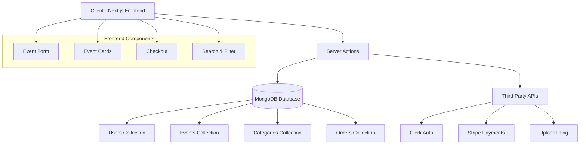
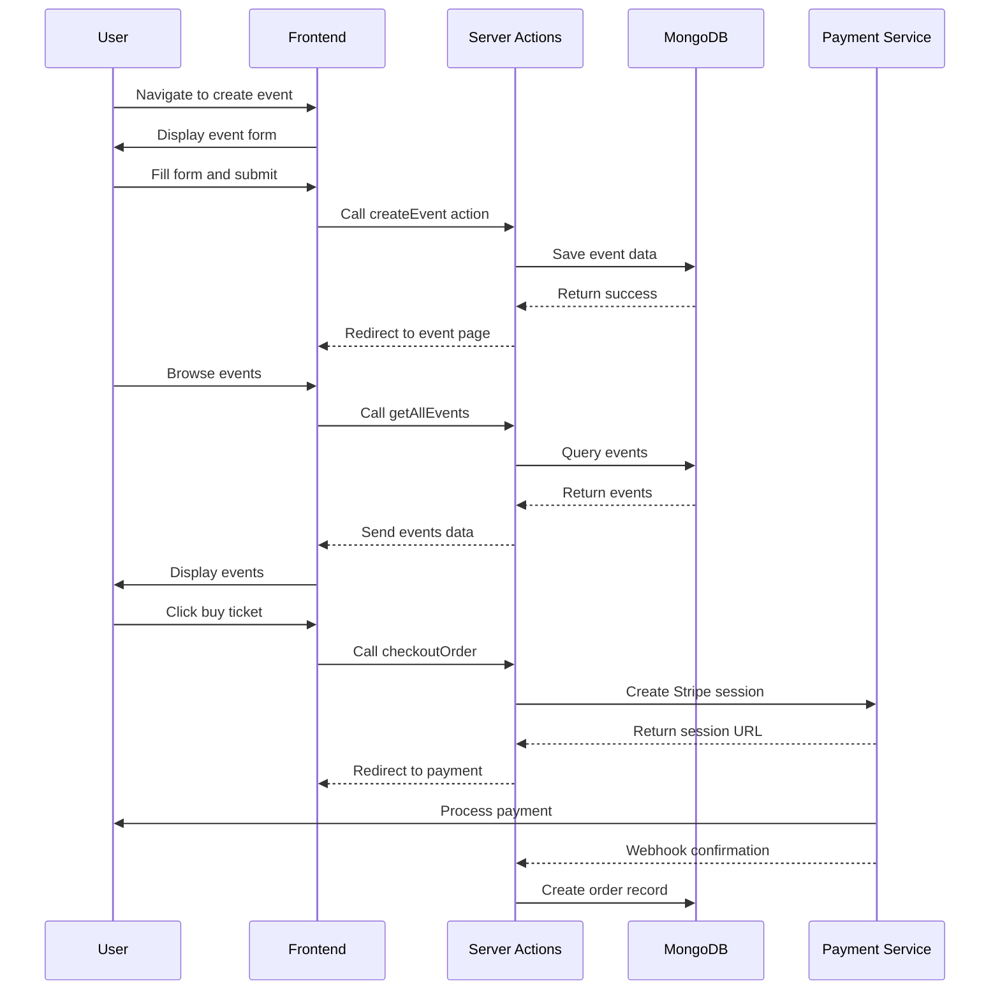
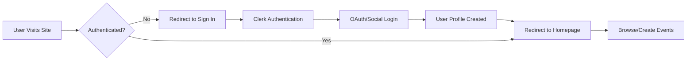
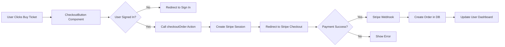
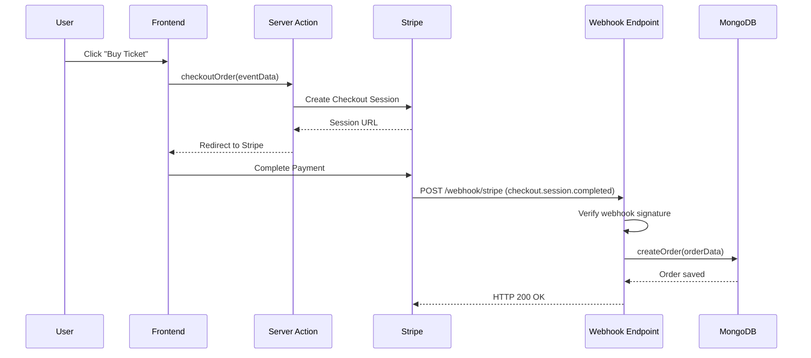
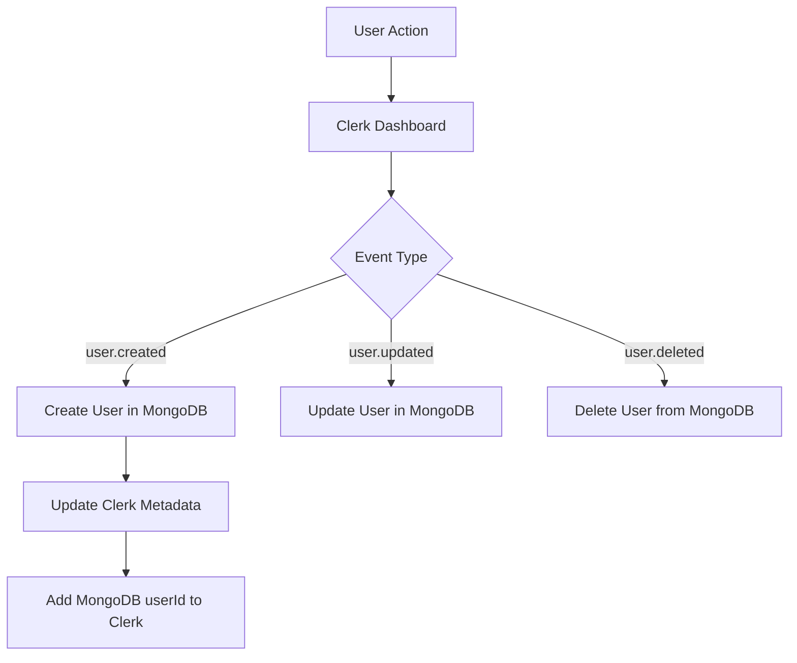

## Project Overview

# Event Management System


A full-featured Event Management System built with Next.js 14, allowing users to create, discover, and manage events with secure authentication and payment processing.

## 🌟 Key Features

| Feature                 | Description                                              |
| ----------------------- | -------------------------------------------------------- |
| **Event Creation**      | Users can create and manage events with rich details     |
| **Ticket Booking**      | Secure ticket purchasing with Stripe integration         |
| **User Authentication** | Secure authentication with Clerk                         |
| **Event Discovery**     | Browse and search events by category, date, and location |
| **Profile Management**  | Personal dashboard for managing events and tickets       |
| **Image Upload**        | Upload event images with UploadThing integration         |
| **Responsive Design**   | Fully responsive UI for all device sizes                 |

## 📸 Preview

<div align="center">
  

  <p><em>Event Management Dashboard</em></p>
</div>

## 🏗️ Architecture Overview



## 🛠️ Tech Stack

### Frontend

| Technology          | Purpose                                       |
| ------------------- | --------------------------------------------- |
| **Next.js 14**      | React framework with App Router               |
| **TypeScript**      | Type safety and enhanced developer experience |
| **Tailwind CSS**    | Utility-first CSS framework                   |
| **ShadCN/UI**       | Component library built on Radix UI           |
| **React Hook Form** | Form validation and handling                  |
| **Zod**             | Schema validation                             |

### Backend & Services

| Technology      | Purpose                            |
| --------------- | ---------------------------------- |
| **MongoDB**     | Primary database                   |
| **Mongoose**    | MongoDB object modeling            |
| **Clerk**       | Authentication and user management |
| **Stripe**      | Payment processing                 |
| **UploadThing** | Image/file uploads                 |

## 📁 Project Structure

```
EVENT-MANAGEMENT-SYSTEM/
├── app/                     # Next.js 14 app directory
│   ├── (auth)/             # Authentication routes
│   ├── (root)/             # Main application pages
│   └── api/                # API routes
├── components/             # Reusable UI components
│   ├── shared/             # Shared components
│   └── ui/                 # ShadCN/UI components
├── constants/              # Application constants
├── lib/                    # Business logic and utilities
│   ├── actions/            # Server actions
│   ├── database/           # Database models and connections
│   └── validators/         # Form validation schemas
├── public/                 # Static assets
└── types/                  # TypeScript types
```

## 🔄 Data Flow Diagram



## 🔐 Authentication Flow



## 💳 Payment Processing Flow



## 🚀 Getting Started

### Prerequisites

- Node.js 18+
- MongoDB database
- Clerk account
- Stripe account
- UploadThing account

### Environment Variables

Create a `.env` file with the following variables:

```
# NEXT.JS
NEXT_PUBLIC_SERVER_URL=http://localhost:3000

# CLERK AUTHENTICATION
NEXT_PUBLIC_CLERK_PUBLISHABLE_KEY=your_clerk_publishable_key
CLERK_SECRET_KEY=your_clerk_secret_key
WEBHOOK_SECRET=your_webhook_secret
NEXT_PUBLIC_CLERK_SIGN_IN_URL=/sign-in
NEXT_PUBLIC_CLERK_SIGN_UP_URL=/sign-up
NEXT_PUBLIC_CLERK_AFTER_SIGN_IN_URL=/
NEXT_PUBLIC_CLERK_AFTER_SIGN_UP_URL=/

# DATABASE
MONGODB_URI=your_mongodb_connection_string

# UPLOADTHING
UPLOADTHING_SECRET=your_uploadthing_secret
UPLOADTHING_APP_ID=your_uploadthing_app_id

# STRIPE
STRIPE_SECRET_KEY=your_stripe_secret_key
STRIPE_WEBHOOK_SECRET=your_stripe_webhook_secret
NEXT_PUBLIC_STRIPE_PUBLISHABLE_KEY=your_stripe_publishable_key
```

### Installation

1. Clone the repository:

```bash
git clone https://github.com/yourusername/event-management-system.git
cd event-management-system
```

2. Install dependencies:

```bash
npm install
```

3. Set up environment variables (see above)

4. Run the development server:

```bash
npm run dev
```

5. Open [http://localhost:3000](http://localhost:3000) in your browser

## 🎯 Core Functionality

### Event Management

| Action     | Description                                                                               |
| ---------- | ----------------------------------------------------------------------------------------- |
| **Create** | Users can create new events with title, description, dates, location, pricing, and images |
| **Read**   | Browse all events, search by keywords, filter by category                                 |
| **Update** | Event organizers can edit their events                                                    |
| **Delete** | Event organizers can delete their events                                                  |

### User Roles

| Role                   | Permissions                                     |
| ---------------------- | ----------------------------------------------- |
| **Guest**              | Browse events, view event details               |
| **Authenticated User** | Create events, purchase tickets, manage profile |
| **Event Organizer**    | Manage own events, view attendee lists          |

### Data Models

#### Event Model

```
interface IEvent {
  _id: string;
  title: string;
  description?: string;
  location?: string;
  createdAt: Date;
  imageUrl: string;
  startDateTime: Date;
  endDateTime: Date;
  price: string;
  isFree: boolean;
  url?: string;
  category: { _id: string, name: string }
  organizer: { _id: string, firstName: string, lastName: string }
}
```

#### User Model

```
interface IUser {
  _id: string;
  clerkId: string;
  firstName: string;
  lastName: string;
  username: string;
  email: string;
  photo: string;
  events: string[]; // References to created events
}
```

## 🧪 Testing Strategy

| Test Type             | Tools                       | Coverage                   |
| --------------------- | --------------------------- | -------------------------- |
| **Unit Tests**        | Jest, React Testing Library | Components & Utilities     |
| **Integration Tests** | Cypress                     | User flows                 |
| **E2E Tests**         | Playwright                  | Full application workflows |

## 📈 Performance Optimizations

| Optimization           | Implementation                                               |
| ---------------------- | ------------------------------------------------------------ |
| **Server Components**  | Leveraging Next.js 14 server components for faster rendering |
| **Image Optimization** | Using Next.js Image component                                |
| **Code Splitting**     | Dynamic imports for heavy components                         |
| **Caching**            | Revalidation strategies with `revalidatePath`                |

## 🤝 Contributing

1. Fork the repository
2. Create your feature branch (`git checkout -b feature/AmazingFeature`)
3. Commit your changes (`git commit -m 'Add some AmazingFeature'`)
4. Push to the branch (`git push origin feature/AmazingFeature`)
5. Open a Pull Request

## 🌐 Webhook System Explanation

The Event Management System uses webhooks to synchronize data between external services (Stripe, Clerk) and the MongoDB database. This ensures real-time updates without polling.

### Stripe Webhook Integration

When a user purchases a ticket, the system creates a Stripe checkout session. Once the payment is completed, Stripe sends a webhook to our application to confirm the transaction and store the order details.

#### Flowchart: Stripe Payment Webhook



#### Key Components:

1. **Checkout Process**:

   - User initiates ticket purchase through [CheckoutButton.tsx](components/shared/CheckoutButton.tsx)
   - [checkoutOrder](lib/actions/order.actions.ts) creates a Stripe session with metadata
   - User completes payment on Stripe checkout page

2. **Webhook Handling**:

   - Stripe sends `checkout.session.completed` event to `/api/webhook/stripe/route.ts`
   - Webhook verifies the signature using `STRIPE_WEBHOOK_SECRET`
   - Extracts order data from event metadata
   - Calls [createOrder](lib/actions/order.actions.ts) to store in MongoDB

3. **Data Storage**:
   - Order information stored in [Order collection](lib/database/models/order.model.ts)
   - References to Event and User documents maintained via ObjectId
   - Stripe ID stored for reconciliation purposes

### Clerk Webhook Integration

Clerk webhooks synchronize user data between Clerk's authentication system and our MongoDB database, ensuring consistency across platforms.

#### Flowchart: Clerk Authentication Webhook



#### Key Components:

1. **User Synchronization**:

   - When a user signs up, Clerk sends `user.created` event to `/api/webhook/clerk/route.ts`
   - Webhook creates a corresponding user document in [User collection](lib/database/models/user.model.ts)
   - MongoDB `_id` is added to Clerk's public metadata for client-side access

2. **Profile Updates**:

   - When user updates profile, Clerk sends `user.updated` event
   - Webhook synchronizes changes to MongoDB user document

3. **Account Deletion**:
   - When user deletes account, Clerk sends `user.deleted` event
   - Webhook removes user from MongoDB and cleans up related data

### Webhook Security

Both webhook implementations include security measures:

1. **Stripe Webhooks**:

   - Signature verification using `stripe.webhooks.constructEvent`
   - Requires `STRIPE_WEBHOOK_SECRET` environment variable

2. **Clerk Webhooks**:
   - Signature verification using Svix library
   - Requires `WEBHOOK_SECRET` environment variable

### Webhook Endpoint URLs

- Stripe Webhook: `POST /api/webhook/stripe`
- Clerk Webhook: `POST /api/webhook/clerk`

These endpoints must be publicly accessible URLs for the services to send events. During local development, tools like ngrok can be used to expose localhost endpoints.

## 📄 License

This project is licensed under the MIT License - see the [LICENSE](LICENSE) file for details.

## 🙏 Acknowledgments

- [Next.js](https://nextjs.org/) for the amazing React framework
- [Clerk](https://clerk.dev/) for authentication
- [Stripe](https://stripe.com/) for payment processing
- [UploadThing](https://uploadthing.com/) for file uploads
- [ShadCN/UI](https://ui.shadcn.com/) for beautiful components
- [Tailwind CSS](https://tailwindcss.com/) for styling

---

## 👤 Author

**Mausam Kar**

- Email: [mausamkumkar@gmail.com](mailto:mausamkumkar@gmail.com)
- Phone: +918638545574
- GitHub: [@Mausam5055](https://github.com/Mausam5055)
- Portfolio: [mausam03.vercel.app](https://mausam03.vercel.app)
