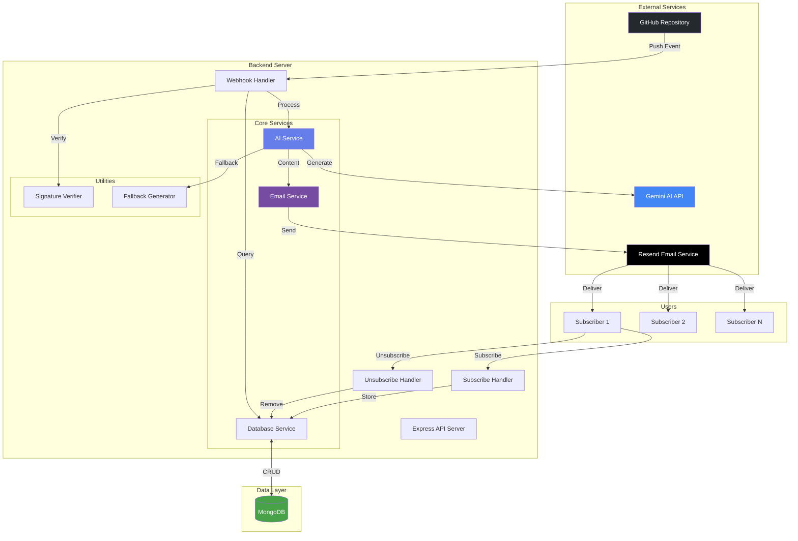
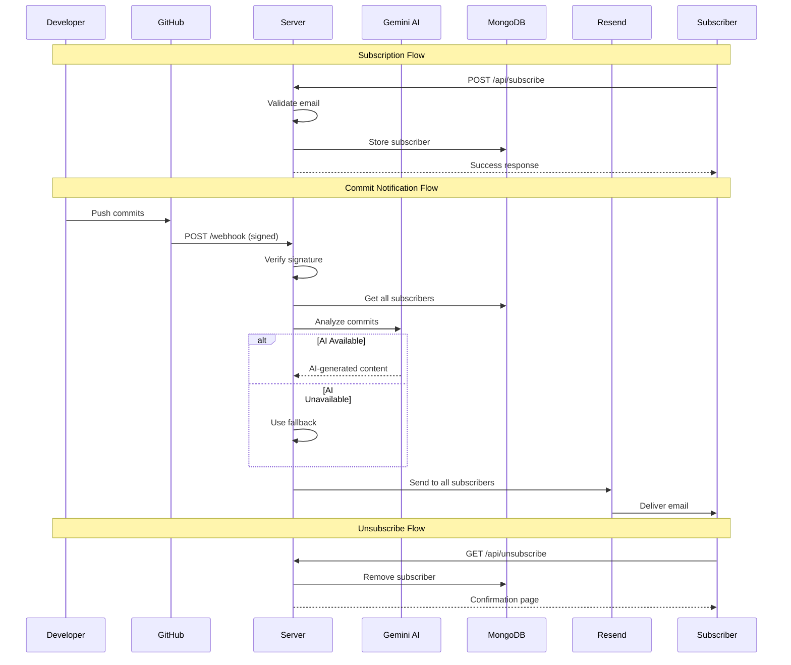
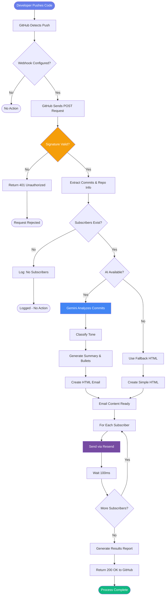

<div align="center">

### Automatically notify subscribers about GitHub commits with AI-powered summaries

[](https://nodejs.org/)
[](https://expressjs.com/)
[](https://www.mongodb.com/)
[](https://ai.google.dev/)
[](https://resend.com/)

[](https://opensource.org/licenses/MIT)
[]()
[]()

[Features](#-features) • [Quick Start](#-quick-start) • [Architecture](#-architecture) • [API Reference](#-api-reference) • [Deployment](#-deployment)

</div>

---

## 📋 Table of Contents

- [Overview](#-overview)
- [Features](#-features)
- [Architecture](#-architecture)
- [Tech Stack](#-tech-stack)
- [Prerequisites](#-prerequisites)
- [Quick Start](#-quick-start)
- [Configuration](#-configuration)
- [API Reference](#-api-reference)
- [Workflow](#-workflow)
- [Security](#-security)
- [Deployment](#-deployment)
- [Testing](#-testing)
- [Contributing](#-contributing)

### Core Functionality

| Feature                | Description                                     | Status |
| ---------------------- | ----------------------------------------------- | ------ |
| **Email Subscription** | REST API endpoint for users to subscribe        | ✅     |
| **Unsubscribe System** | One-click unsubscribe (GDPR/CAN-SPAM compliant) | ✅     |
| **GitHub Webhooks**    | Secure webhook listener with HMAC verification  | ✅     |
| **AI Analysis**        | Gemini AI analyzes commits and detects tone     | ✅     |
| **Fallback Mode**      | Automatic fallback when AI is unavailable       | ✅     |
| **HTML Emails**        | Beautiful, responsive email templates           | ✅     |
| **MongoDB Storage**    | Subscriber management with validation           | ✅     |

### Security Features

| Feature                   | Implementation                          | Protection Level |
| ------------------------- | --------------------------------------- | ---------------- |
| **XSS Protection**        | HTML escaping of all user content       | 🛡️ High          |
| **CORS**                  | Configurable origin whitelist           | 🛡️ High          |
| **Rate Limiting**         | 10 req/min per IP on subscribe endpoint | 🛡️ Medium        |
| **Webhook Verification**  | HMAC SHA256 signature validation        | 🛡️ High          |
| **Input Validation**      | Email format and length validation      | 🛡️ Medium        |
| **Environment Isolation** | All secrets in environment variables    | 🛡️ High          |

---

## 🏗️ Architecture

### System Architecture



### Data Flow



---

## 🛠️ Tech Stack

### Backend Framework

- **Node.js** 18.x+ - JavaScript runtime
- **Express.js** 4.x - Web framework
- **ES Modules** - Modern import/export syntax

### Database

- **MongoDB** 8.x - NoSQL database
- **Mongoose** 8.x - ODM for MongoDB

### AI & Email

- **Google Gemini AI** - Commit analysis and summarization
- **Resend** - Transactional email service

### Security & Utilities

- **crypto** - HMAC signature verification
- **dotenv** - Environment variable management

---

## 📦 Prerequisites

Before you begin, ensure you have the following:

| Requirement        | Version        | Purpose                              |
| ------------------ | -------------- | ------------------------------------ |
| **Node.js**        | 18.x or higher | Runtime environment                  |
| **npm**            | 8.x or higher  | Package manager                      |
| **MongoDB**        | 5.x or higher  | Database (local or Atlas)            |
| **Gemini API Key** | -              | AI features (optional, has fallback) |
| **Resend API Key** | -              | Email delivery                       |
| **GitHub Account** | -              | Webhook source                       |

### Get API Keys

| Service                                                       | Sign Up        | Free Tier      |
| ------------------------------------------------------------- | -------------- | -------------- |
| [Gemini AI](https://makersuite.google.com/app/apikey)         | Get API Key    | ✅ Available   |
| [Resend](https://resend.com/signup)                           | Create Account | 100 emails/day |
| [MongoDB Atlas](https://www.mongodb.com/cloud/atlas/register) | Create Cluster | 512 MB free    |

---

## 🚀 Quick Start

### 1️⃣ Clone & Install

```bash
# Clone the repository
git clone <your-repo-url>
cd backend

# Install dependencies
npm install
```

### 2️⃣ Configure Environment

```bash
# Copy example environment file
cp .env.example .env

# Edit .env with your credentials
nano .env
```

Required configuration:

```env
MONGO_URI=mongodb://localhost:27017/github-automation
GEMINI_API_KEY=your_gemini_api_key_here
RESEND_API_KEY=your_resend_api_key_here
EMAIL_FROM=noreply@yourdomain.com
GITHUB_WEBHOOK_SECRET=your_webhook_secret_here
PORT=4000
SERVER_URL=http://localhost:4000
ALLOWED_ORIGINS=*
```

### 3️⃣ Start the Server

```bash
# Development mode (with auto-reload)
npm run dev

# Production mode
npm start
```

You should see:

```
✅ Environment variables validated
✅ MongoDB connected successfully
✅ Gemini AI initialized successfully
✅ Resend email service initialized
✅ Server running on port 4000
```

### 4️⃣ Setup GitHub Webhook

1. Go to your GitHub repository → **Settings** → **Webhooks** → **Add webhook**

2. Configure:

   - **Payload URL**: `https://your-domain.com/api/github/webhook`
   - **Content type**: `application/json`
   - **Secret**: Same as `GITHUB_WEBHOOK_SECRET` in `.env`
   - **Events**: Select "Just the push event"
   - **Active**: ✅ Checked

3. Click **Add webhook**

---

## ⚙️ Configuration

### Environment Variables

| Variable                | Required    | Default                 | Description                                       |
| ----------------------- | ----------- | ----------------------- | ------------------------------------------------- |
| `MONGO_URI`             | ✅ Yes      | -                       | MongoDB connection string                         |
| `GEMINI_API_KEY`        | ⚠️ Optional | -                       | Google Gemini API key (uses fallback if missing)  |
| `RESEND_API_KEY`        | ✅ Yes      | -                       | Resend email API key                              |
| `EMAIL_FROM`            | ✅ Yes      | -                       | Sender email address (must be verified in Resend) |
| `GITHUB_WEBHOOK_SECRET` | ✅ Yes      | -                       | Secret for webhook signature verification         |
| `PORT`                  | ❌ No       | `4000`                  | Server port                                       |
| `SERVER_URL`            | ❌ No       | `http://localhost:4000` | Server URL for unsubscribe links                  |
| `ALLOWED_ORIGINS`       | ❌ No       | `*`                     | CORS allowed origins (comma-separated)            |
| `DEVELOPER_NAME`        | ❌ No       | `Developer`             | Your name for email signature                     |
| `TECH_STACK`            | ❌ No       | `Full Stack Developer`  | Your tech stack for email signature               |
| `NODE_ENV`              | ❌ No       | -                       | Environment (development/production)              |

### Production Configuration

For production, set specific CORS origins:

```env
ALLOWED_ORIGINS=https://yourdomain.com,https://www.yourdomain.com
SERVER_URL=https://api.yourdomain.com
NODE_ENV=production
```

---

## 📡 API Reference

### Endpoints Overview

| Method | Endpoint              | Purpose           | Auth    | Rate Limit    |
| ------ | --------------------- | ----------------- | ------- | ------------- |
| `GET`  | `/health`             | Health check      | ❌      | None          |
| `POST` | `/api/subscribe`      | Subscribe email   | ❌      | 10/min per IP |
| `GET`  | `/api/unsubscribe`    | Unsubscribe email | ❌      | None          |
| `POST` | `/api/github/webhook` | GitHub webhook    | ✅ HMAC | None          |

---

### 📥 Subscribe

Subscribe a new email address to receive updates.

**Endpoint:** `POST /api/subscribe`

**Request:**

```json
{
  "email": "user@example.com"
}
```

**Success Response:** `201 Created`

```json
{
  "success": true,
  "message": "Successfully subscribed!",
  "data": {
    "email": "user@example.com",
    "subscribedAt": "2024-01-15T10:30:00.000Z"
  }
}
```

**Error Responses:**

| Status | Error                    | Description                    |
| ------ | ------------------------ | ------------------------------ |
| `400`  | Invalid email format     | Email doesn't match validation |
| `409`  | Email already subscribed | Duplicate subscription         |
| `429`  | Too many requests        | Rate limit exceeded            |
| `500`  | Internal server error    | Server error                   |

---

### 🚫 Unsubscribe

Remove email from subscription list.

**Endpoint:** `GET /api/unsubscribe?email=user@example.com`

**Success Response:** `200 OK` (HTML page)

Returns a user-friendly HTML confirmation page.

---

### 🪝 GitHub Webhook

Receives and processes GitHub push events.

**Endpoint:** `POST /api/github/webhook`

**Headers Required:**

- `x-hub-signature-256`: HMAC signature
- `x-github-event`: Event type (`push`)

**Success Response:** `200 OK`

```json
{
  "success": true,
  "message": "Webhook processed successfully",
  "data": {
    "repository": "my-repo",
    "commits": 3,
    "subscribers": 10,
    "emailsSent": 9,
    "emailsFailed": 1
  }
}
```

---

### 💚 Health Check

Check server status and service health.

**Endpoint:** `GET /health`

**Response:** `200 OK`

```json
{
  "success": true,
  "message": "Server is running",
  "timestamp": "2024-01-15T10:30:00.000Z",
  "services": {
    "database": "connected",
    "ai": "enabled",
    "email": "enabled"
  }
}
```

---

## 🔄 Workflow

### Complete System Flow



---

## 🔒 Security

### Security Measures Implemented

| Layer     | Measure                | Implementation                            |
| --------- | ---------------------- | ----------------------------------------- |
| **Input** | Email Validation       | RFC 5321 compliant regex, max 254 chars   |
| **Input** | Email Sanitization     | Trim, lowercase, type coercion            |
| **XSS**   | HTML Escaping          | All user content escaped before rendering |
| **CSRF**  | CORS Protection        | Configurable origin whitelist             |
| **DDoS**  | Rate Limiting          | 10 requests/minute per IP                 |
| **Auth**  | Webhook Verification   | HMAC SHA256 signature validation          |
| **Auth**  | Timing-Safe Comparison | Prevents timing attacks                   |
| **Data**  | Environment Isolation  | All secrets in .env file                  |
| **Code**  | Input Validation       | Comprehensive validation on all endpoints |

### Security Score

**Overall: 9.5/10** 🛡️

- ✅ OWASP Top 10 Protected
- ✅ GDPR Compliant (unsubscribe functionality)
- ✅ CAN-SPAM Act Compliant
- ✅ Production-grade error handling
- ✅ Graceful shutdown mechanisms

---

## 🚢 Deployment

### Deployment Options

Choose your preferred platform:

#### **Railway** (Recommended)

```bash
# Install Railway CLI
npm install -g railway

# Login and initialize
railway login
railway init

# Add environment variables in Railway dashboard
# Deploy
railway up
```

#### **Render**

1. Connect your GitHub repository
2. Create a new **Web Service**
3. Add environment variables in dashboard
4. Deploy automatically on push

#### **VPS (Ubuntu)**

```bash
# Install dependencies
sudo apt update
sudo apt install nodejs npm mongodb

# Clone and setup
git clone <your-repo>
cd backend
npm install

# Use PM2 for process management
npm install -g pm2
pm2 start server.js --name github-automation
pm2 save
pm2 startup
```

### Environment Setup for Production

1. Set `NODE_ENV=production`
2. Use specific `ALLOWED_ORIGINS` (not `*`)
3. Set `SERVER_URL` to your domain
4. Use MongoDB Atlas for database
5. Configure proper logging

---

## 🧪 Testing

### Manual Testing

```bash
# Test health endpoint
curl http://localhost:4000/health

# Test subscribe
curl -X POST http://localhost:4000/api/subscribe \
  -H "Content-Type: application/json" \
  -d '{"email": "test@example.com"}'

# Test unsubscribe
curl "http://localhost:4000/api/unsubscribe?email=test@example.com"

# Test rate limiting
for i in {1..15}; do
  curl -X POST http://localhost:4000/api/subscribe \
    -H "Content-Type: application/json" \
    -d "{\"email\": \"test$i@test.com\"}"
done
```

### Security Testing

```bash
# Test XSS protection
curl -X POST http://localhost:4000/api/subscribe \
  -H "Content-Type: application/json" \
  -d '{"email": "<script>alert(\"XSS\")</script>@test.com"}'

# Should sanitize and reject invalid email
```

---

## 📁 Project Structure

```
backend/
├── server.js                 # Express server + middleware
├── package.json              # Dependencies
├── .env.example              # Environment template
├── .gitignore               # Git exclusions
│
├── routes/
│   ├── subscribe.js         # Subscribe/unsubscribe endpoints
│   └── github.js            # Webhook handler
│
├── services/
│   ├── dbService.js         # MongoDB operations
│   ├── aiService.js         # Gemini AI integration
│   └── emailService.js      # Resend email service
│
└── utils/
    ├── verifySignature.js   # HMAC verification
    └── fallback.js          # Fallback HTML generator
```

---

## 🤝 Contributing

Contributions are welcome! Please follow these steps:

1. Fork the repository
2. Create a feature branch (`git checkout -b feature/amazing-feature`)
3. Commit your changes (`git commit -m 'Add amazing feature'`)
4. Push to the branch (`git push origin feature/amazing-feature`)
5. Open a Pull Request

### Development Guidelines

- Follow existing code style (ES modules, async/await)
- Add JSDoc comments for new functions
- Test thoroughly before submitting
- Update README if adding new features

---

## 👤 Author

**Mausam Kar**

- Email: [mausamkumkar@gmail.com](mailto:mausamkumkar@gmail.com)
- Phone: +918638545574
- GitHub: [@Mausam5055](https://github.com/Mausam5055)
- Portfolio: [mausam03.vercel.app](https://mausam03.vercel.app)

## 🙏 Acknowledgments

- [Google Gemini AI](https://ai.google.dev/) - AI-powered commit analysis
- [Resend](https://resend.com/) - Beautiful email delivery
- [MongoDB](https://www.mongodb.com/) - Reliable NoSQL database
- [Express.js](https://expressjs.com/) - Fast, minimalist web framework

---

## 📞 Support

Need help? Here are some resources:

- 📖 [Documentation](./README.md)
- 🐛 [Report Bug](https://github.com/your-repo/issues)
- 💡 [Request Feature](https://github.com/your-repo/issues)
- 📧 Email: your-email@example.com

---

<div align="center">

### ⭐ Star this repository if you found it helpful!

Made with ❤️ using Node.js, Express, MongoDB, Gemini AI, and Resend

**[Back to Top](#-github-email-automation)**

</div>
