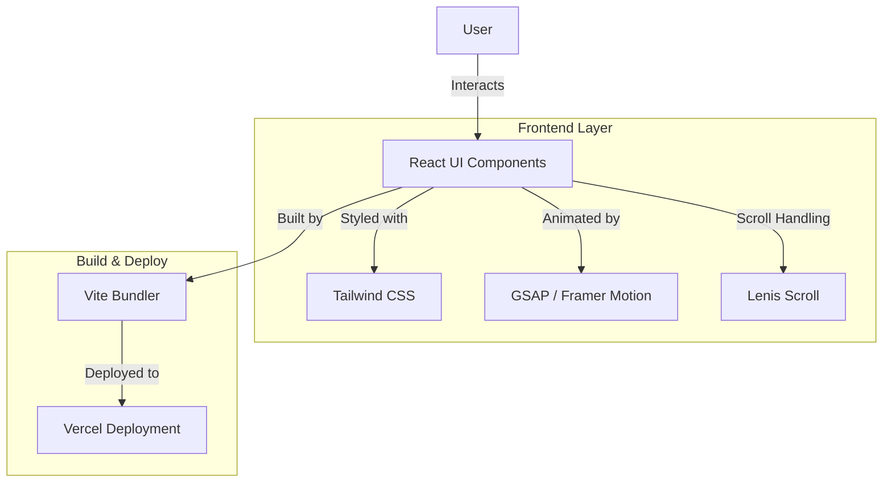
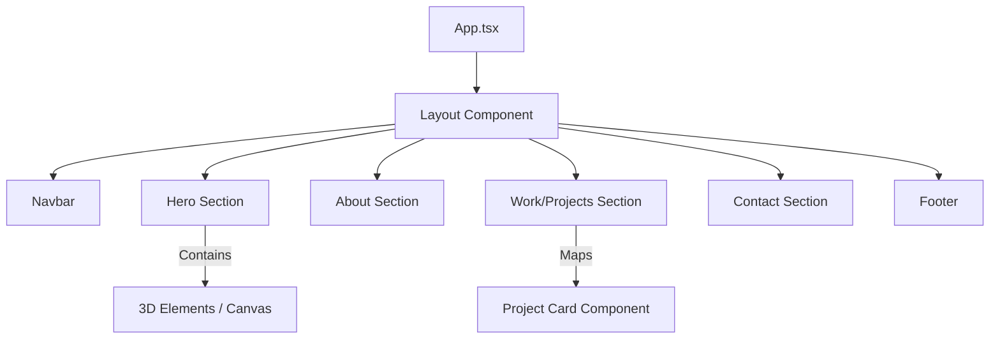
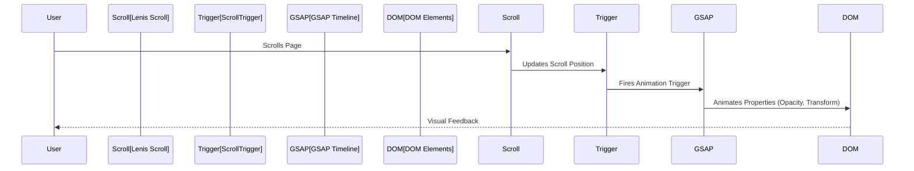

# Priyanka Interactive Portfolio


A modern, interactive portfolio website built with React, TypeScript, and GSAP animations.

## 🚀 Features

| Feature               | Description                                          |
| --------------------- | ---------------------------------------------------- |
| **Smooth Scrolling**  | Implemented with Lenis for buttery-smooth navigation |
| **Animations**        | GSAP and Framer Motion for enhanced user experience  |
| **Responsive Design** | Built with Tailwind CSS for all device sizes         |
| **Type Safety**       | TypeScript for robust development                    |
| **Modern React**      | Built with React 18 and Hooks                        |
| **Performance**       | Optimized with Vite                                  |

## 🏗️ System Architecture

The application is built using a component-based architecture, leveraging React for UI structure and GSAP for advanced animations.



## 🧩 Component Structure

The application follows a modular component structure for maintainability and reusability.



## 🔄 Animation Workflow

Animations are orchestrated using GSAP Timelines and ScrollTrigger for scroll-based effects.



## 🛠️ Tech Stack

| Category                | Technologies        |
| ----------------------- | ------------------- |
| **Frontend Framework**  | React 18            |
| **Language**            | TypeScript          |
| **Styling**             | Tailwind CSS        |
| **Animation Libraries** | GSAP, Framer Motion |
| **Routing**             | React Router DOM    |
| **Build Tool**          | Vite                |
| **Linting**             | ESLint              |
| **Package Manager**     | npm                 |

## 📦 Installation

1. **Clone the repository:**

```bash
git clone https://github.com/Mausam5055/Priyanka-Interactive.git
```

2. **Install dependencies:**

```bash
npm install
```

3. **Start the development server:**

```bash
npm run dev
```

4. **Build for production:**

```bash
npm run build
```

## 🎯 Project Structure

```
src/
├── assets/         # Static assets
├── components/     # React components
├── utils/         # Utility functions
├── App.tsx        # Main application component
├── main.tsx       # Application entry point
└── index.css      # Global styles
```

## 🔧 Available Scripts

| Script            | Description              |
| ----------------- | ------------------------ |
| `npm run dev`     | Start development server |
| `npm run build`   | Build for production     |
| `npm run lint`    | Run ESLint               |
| `npm run preview` | Preview production build |

## 📝 License

This project is licensed under the MIT License - see the LICENSE file for details.

## 🤝 Contributing

Contributions are welcome! Please feel free to submit a Pull Request.
