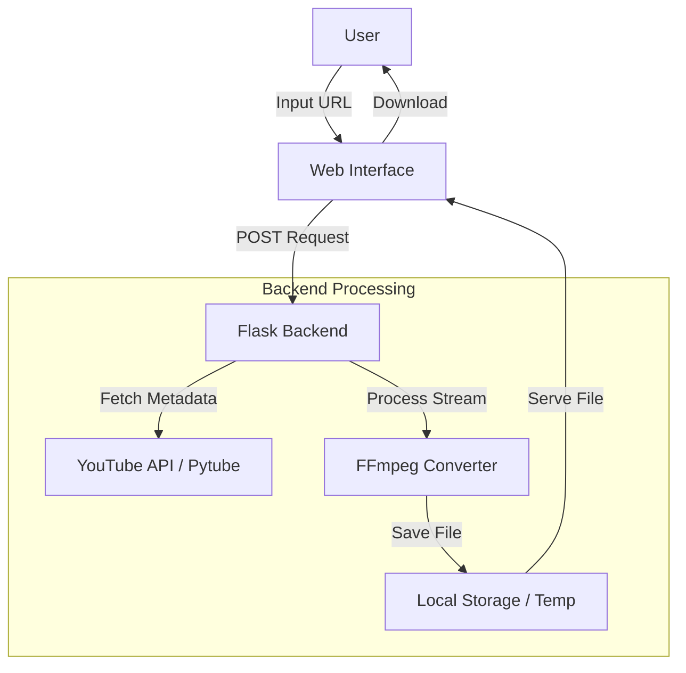
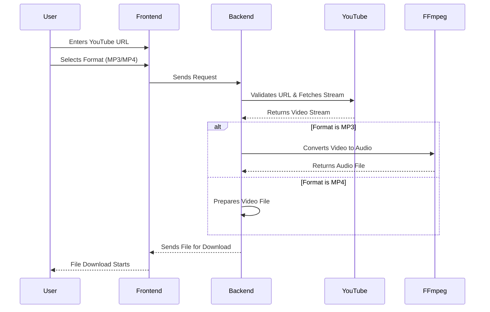

# YouTube Video & MP3 Downloader 🎥🎵

[](https://www.python.org/)
[](https://opensource.org/licenses/MIT)
[](https://flask.palletsprojects.com/)

A simple yet powerful Flask-based web application designed to download YouTube videos as MP4 files or convert them to high-quality MP3 audio.

## 🚀 Features

| Feature                  | Description                                                      |
| ------------------------ | ---------------------------------------------------------------- |
| 📥 **Video Download**    | Download YouTube videos in MP4 format with varying resolutions.  |
| 🎧 **Audio Conversion**  | Convert videos to MP3 audio using FFmpeg for high-quality sound. |
| 📊 **Progress Tracking** | Real-time progress bar to track download status.                 |
| 📱 **Responsive UI**     | Modern, mobile-friendly interface built with HTML/CSS.           |
| ⚡ **Fast Processing**   | Optimized backend for quick URL parsing and conversion.          |

## 🏗️ System Architecture

The application follows a simple client-server architecture using Flask as the backend framework.



## 🔄 Download Process Flow

This diagram illustrates the step-by-step process from URL input to file download.



## 🛠️ Tech Stack

| Component     | Technology                 |
| ------------- | -------------------------- |
| **Backend**   | Python, Flask              |
| **Frontend**  | HTML5, CSS3, JavaScript    |
| **Libraries** | Pytube (or yt-dlp), FFmpeg |
| **Tools**     | Git, VS Code               |

## 🛠️ Installation & Setup

### Prerequisites

- Python 3.7+
- FFmpeg (for MP3 conversion)
- Stable internet connection

### 1️⃣ Clone Repository

```bash
git clone https://github.com/Mausam5055/You-Tube_Downloader-V02.git
cd You-Tube_Downloader-V02
```

### 2️⃣ Virtual Environment Setup

```bash
# Create virtual environment
python -m venv venv

# Activate environment
# Windows:
venv\Scripts\activate
# MacOS/Linux:
source venv/bin/activate
```

### 3️⃣ Install Dependencies

```bash
pip install -r requirements.txt
```

### 4️⃣ FFmpeg Installation

#### Windows

- Download from [FFmpeg Official Builds](https://ffmpeg.org/download.html)
- Extract ZIP and add `ffmpeg/bin` to system PATH
- Verify installation:

```cmd
ffmpeg -version
```

#### MacOS (Homebrew)

```bash
brew install ffmpeg
```

#### Linux (Debian/Ubuntu)

```bash
sudo apt update && sudo apt install ffmpeg
```

### 5️⃣ Run Application

```bash
python app.py
# For custom port:
python app.py --port 10000
```

Access the app at: [http://localhost:10000](http://localhost:10000)

## 🔧 Troubleshooting

| Issue                   | Solution                                                |
| ----------------------- | ------------------------------------------------------- |
| **FFmpeg not found**    | Verify PATH configuration, restart terminal.            |
| **Dependency errors**   | Update pip: `pip install --upgrade pip`.                |
| **Port already in use** | Use different port: `--port 5000`.                      |
| **Download fails**      | Check YouTube URL validity or update `pytube`/`yt-dlp`. |

## 🚀 What's Next?

- [ ] Add playlist support
- [ ] Implement quality selection (1080p, 4K)
- [ ] Add download history tracking
- [ ] User authentication for saving preferences

## 🌜 License

Distributed under the MIT License. See [LICENSE](LICENSE) for more information.

## 👨‍💻 Author

**Mausam Kar**  
[GitHub](https://github.com/Mausam5055/)  
Contributions & suggestions welcome! 🚀
